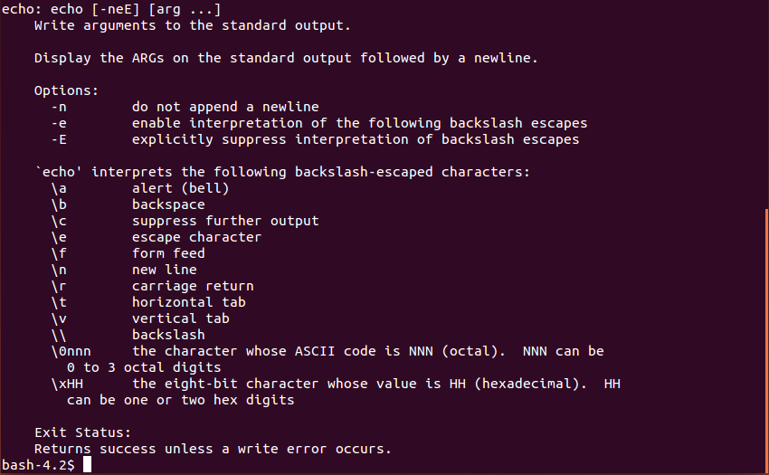
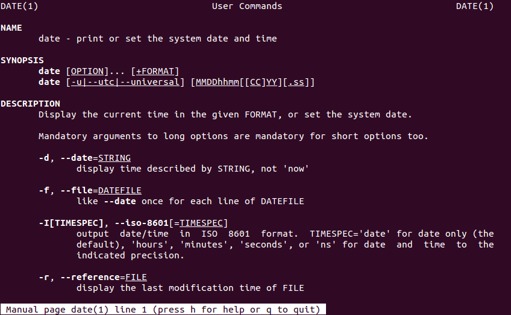

[TBI]: <> (This is a comment)

### Table of Contents
1. [Introduction](#Introduction)
2. [Shell environment](#environment)
     A) [Commands](#commands)
     B) [Variables](#variables)
3. [Editing a file in the terminal](#editing_file)
4. [Your first **Bash** script](#first_script)
5. [Positional parameters](#positional_parameters)
6. [**Bash** functions: Your first **Linux/Bash** command](#first_command)
7. [Using an arbitrary executable as **Linux/Bash** command](#arbitrary_executable)
     A) [Setting file permissions](#permissions)
     B) [**PATH** variable](#path)


### 1. Introduction <a name="Introduction"></a>

When it comes to the operating systems nowadays, in high-energy experimental physics we mostly rely on Linux. That being said, as an experimental physicist you are sooner or later faced with the following situation: You have turned on your computer and launched the terminal...
 


... and what now?? 

You can start clicking with the mouse over the terminal, but quickly you will realize that this leads you nowhere. Next, you can start typing and pressing 'Enter', but especially if you do it for the first time most likely whatever you have typed in the terminal will produce only the error messages. Still, that is something, as it clearly means that there is some secret/magic language which is trying to respond to, or to interpret, your command input, as soon as you have typed something in the terminal and pressed 'Enter'. 

What is that secret built-in language available in the terminal? This lecture is all about shedding light on its existence...

Loosely speaking, **shell** is the generic name of any program that the user employs to type commands in the terminal (a.k.a. text window).  Example **shells**:

* sh 
* bash
* ksh
* csh
* zsh
* fish

The list of **shells** available on your computer is stored in the file _/etc/shells_. In order to see its content,  use the **Linux** command **cat** which reads and prints on the screen the content of textual files, i.e. type in the terminal:

```linux
cat /etc/shells 
```
and press 'Enter'. The output of that command could look like:

```bash
/etc/shells: valid login shells
/bin/sh
/bin/dash
/bin/bash
/bin/rbash
/usr/bin/screen
/usr/bin/fish
```

How to select your favorite **shell** from the above list? It's simple, just type its name in the terminal and press 'Enter'! E.g. if you want to use **Bash** as your working **shell**, just type in the terminal:

```linux
bash
```
and press 'Enter' --- now you are in the **Bash** wonderland! Since that is by far the most popular **Linux** **shell** nowadays (in fact it's the default **shell** on most **Linux** distributions), this tutorial will focus exclusively on its concepts, syntax and commands. But no worries, at least conceptually a lot of subjects covered in this tutorial apply also to other **shells**! 

In this lecture we will cover only the  **Bash**  essentials, i.e. we will make you going, but how far you want to go eventually, it depends on your determination and time investment.  Few references for further reading can be found in the preamble of this tutorial.

Traditionally, the first program people write when learning a new programming language is the so-called _"Hello World"_ example. Let's keep up with this tradition and type in the terminal:

```bash
echo "Hello World" 
```

This will output in the terminal:

```bash
Hello World
```

i.e. **Bash** has echoed back the text you have typed in the terminal as an _argument_ of **echo** command. Let's move on!


### 2. Shell environment: commands and variables <a name="environment"></a>

When you open a terminal, your local environment is defined via some command names and predefined variables, which you can use directly in the current terminal session. Before going more into the detail how to modify the environment, let's see how commands and variables are used in general.

#### A) Commands <a name="commands"></a>

We have already seen how one built-in **Bash** command works, namely **echo**. In the same spirit, we can use in the terminal any other **Linux** command, not necessarily the built-in **shell** command.

**Example:** What is the current time? Just type in the terminal command **date**  and press 'Enter':

```linux
date
```

This will output in the terminal something like:
```bash
Mo 29. Apr 10:30:17 CEST 2019
```

This is the default formatting of **date** command. Now please use **date** command with flag (or option) **-u**, in order to modify its default behaviour:

```linux
date -u
```

This will output in the terminal the different stream:
```bash
Mo 29. Apr 08:30:19 UTC 2019
```

By passing a certain flag, we have instructed command **date** to change its default behaviour. In the above example, the flag **-u** caused **date** command to report time in Coordinated Universal Time format (UTC), instead of Central European Summer Time (CEST) time zone (which is the default). 

As another example, we have already seen how we can use **cat** command to view the content of a file, when inquiring which shells are available on the computer. We can pass to command **cat** as arguments more files to read in one go, i.e. we can execute the same command in one go on multiple arguments:

```linux
cat /etc/shells /etc/hostname
```

The output of that command now could look like:

```bash
/etc/shells: valid login shells
/bin/sh
/bin/dash
/bin/bash
/bin/rbash
/usr/bin/screen
/usr/bin/fish
transfer.ktas.ph.tum.de
```

Note the new entry in the last line, which is the content of file _/etc/hostname_ . 

We can, of course, combine both options (flags) and arguments when invoking a command: 

```linux
cat -n /etc/shells 
     1	# /etc/shells: valid login shells
     2	/bin/sh
     3	/bin/dash
     4	/bin/bash
     5	/bin/rbash
     6	/usr/bin/screen
     7	/usr/bin/fish
```

The flag **-n** causes command **cat** to enumerate all lines in the printout.

Based on these simple examples, we now establish the following general statements about commands. In general, all **Bash** and **Linux** commands are conceptually implemented in the same way --- let us now discuss what is conceptually always the same in their implementation and usage. 

Generically, and in the most important cases of interest, we are executing commands in the terminal in the following way:

```linux
<command-name> <option(s)> <argument(s)>
```
where we use notation ```< ... >``` just as a placeholder. This is the right moment to stress the importance and profound meaning of empty character in **Bash** and **Linux**: Empty character is the default input field separator. If you misuse the empty character, a lot of your input in the terminal will be completely incomprehensible to **shell**, and any **Linux** commands in general.  In the above generic example, empty character separates the three items, which conceptually have a completely different meaning. As the very first step, after you have typed the input in the terminal and pressed 'Enter', **Bash** splits your input into tokens that are separated (by default, and in a bit simplified picture) with one or more empty characters. Then, it checks whether the very first token is some known **Bash** or **Linux** command, **Bash** key-word, etc.

Let's look at them one by one...

* ```<command-name>``` : Whatever you type first in the terminal, i.e. before the next empty character is being encountered on terminal input, **Bash** is trying to interpret as some known **Linux** command, **Bash** key-word, etc. In general, ```<command-name>``` can stand for one of the following items:

	1) **Linux** command (i.e. system-wide executable or binary) --- example:  **cat**
	
	2) **Bash**  built-in command --- example: **echo**
	
	3) **Bash** keyword  --- example: **for**
	
	4) alias
	
	5) function
	
	6) script

* ```<option(s)>``` : Options (or flags) are used to modify the default behaviour of command. Options are indicated either with:

	1) **-** (single dash) followed by single character(s), or
	
	2)  **-\-** (two consecutive dashes) followed by a more descriptive explanation of what needs to be modified.

For instance, the frequently used flags **-a** and **-\-all** are synonyms, in a sense that they modify the default behaviour of command in exactly the same way. The first version is easier to type, but the second one is easier to memorize. Example for **date** command:

```linux
date -u
Mo 29. Apr 13:33:59 UTC 2019
date --utc
Mo 29. Apr 13:33:59 UTC 2019
```

But how do we know that for the command **date** flags **-u** and **-\-utc** are available, and how do we know in which way they will modify the default behaviour of command? All such options for each command are documented in so-called _man pages_ . Basically, whenever you develop a new command, it is also essential that you develop its documentation, otherwise nobody will be able to use your command. For built-in **Bash** commands, documentation is retrieved simply with:

```bash
help <command-name>
```

For **Linux**  commands, we need to have a look a the corresponding **man** (shortcut for _manual_) pages: 

```linux
man <command-name>
```

**Example 1:** To see which options are available for built-in **Bash** command **echo**, use:

```bash
help echo
```
You shall get as an output something like:



I.e.  **help** command gives you a complete description of any built-in **Bash** command or **Bash** key-word. 

**Example 2:** To see which options are available for **Linux** command  **date**, use:

```linux
man date
```

The first page of a rather lengthy output could look like:


 
As you can see, even simple commands, like **date**, can have an extensive documentation and a lot of options. It is impossible to memorize all options for all commands, therefore usage of **help** and **man** is needed almost on a daily basis. 

* ```<arguments>``` : This is simple, sometimes you want your command to be executed in one go on multiple arguments. For instance, we can make an empty file in the current working directory by using the **touch** command:

```linux
touch file_1.log
```

In order to list all files and subdirectories in the current working directory, use **ls** command, i.e. 

```linux
ls
```
The output after this example is:
```linux
file_1.log
```

For the more verbose printout (e.g. showing also the file size, etc.) use the flags **-a** and **-l** for **ls** command in the construct like ```ls -al``` (check the _man pages_ of **ls** command  for the meaning of these flags, and for other available options to modify the default behavior of this command). 

In the case we want to use **touch** command to create multiple empty files, it would be extremely annoying if we would need to call this command for each file separately. Instead, we can create plenty of empty files with **touch** command in one go, and not one by one, e.g.

```linux
touch file_1.log file_2.log file_3.log file_4.log
ls
```

**Important remark:** Since the empty character is an input field separator, never use it as a part of the file or directory name! In such a context, always replace it with underscore "_" or any other character which doesn't have special meaning. For instance:

```linux
touch file 1.log
```
would literally create two files, the first one named _file_, and the second one named _1.log_ . As a side remark, if you apply **touch** command on an already existing file, only the creation time-stamp of that file will be updated to the current time, while the file content remains exactly the same (therefore the name **touch**). 

In the same spirit, we can create multiple directories in one go, with **mkdir** command, e.g. 

```linux
mkdir subdir_1 subdir_2 subdir_3
```
will make 3 new subdirectories in your current working directory (check again by executing ```ls -al```).

In order to move from one directory to another, use **Linux** command **cd** ('change directory'), e.g.
```linux
cd subdir_1
```
Now you have moved in the newly created directory ```subdir_1```. In the case you get lost in the filesystem, use **Linux** command **pwd** ('print working directory'), to print on the screen absolute path in the filesystem to your current working directory, e.g. in the current example,

```linux
pwd
```
would print something like
```linux
/home/abilandz/subdir_1
```

By now we have been using only the already existing either **Bash** or **Linux** commands. The simplest way to create your own command, with a rather limited functionality and flexibility but nevertheless quite convenient, is to use **Bash** built-in command **alias**.  For instance, if you are bored to type something lengthy again and again in the terminal, you can introduce shortcut for it, by using the **Bash** built-in command **alias**. For instance, you can abbreviate the lengthy input

```bash
echo "Welcome to the Bash tutorial"
```
into the simple new command ```Hi```, by creating an alias for it with the following definition:

```
alias Hi='echo "Welcome to the Bash tutorial"'
```
Now this input in the terminal shall work as well:

```bash
Hi
```
and the output in the terminal shall be:
```bash
Welcome to the Bash tutorial
```
Quite frequently, **Bash** aliases are used in the following context:  If you want to connect from your desktop machine to some other computer, e.g.  _lxplus_ at CERN, you need to type in the terminal something like

```linux
ssh -Y abilandz@lxplus.cern.ch
```

But do you really want to type that again and again each time you want to connect to _lxplus_? You can save a lot of typing, by introducing the alias for it, e.g.:

```bash
alias lx='ssh -Y abilandz@lxplus.cern.ch'
```
Here basically you have defined an abbreviation (or alias, or shortcut) for the lengthy command input, and in this case, you have named it **lx**. Now it suffices only to type in the terminal 

```bash
lx
```
and you will be connecting to _lxplus_ at CERN with much less effort and time investment. 

Another typical use case of aliases is to prevent command name typos. For instance, if you realize that too frequently instead of **ls** you have typed in the terminal **sl**, which does nothing except producing an error message, you can simply define a new alias for it:
```bash
alias sl=ls
```
With this definition, **sl** is literally a synonym for **ls** command.

If you have forgotten all aliases you have introduced in the current terminal session, just type in the terminal
 
```bash
alias
```
and all of their definitions will show up! If you want to see what is the definition of the concrete alias you have introduced, use 

```bash
alias <alias-name>
```
The definition of some alias can be removed with **Bash** built-in command  **unalias**, e.g.:

```bash
unalias <alias-name> 
```

Aliases are definitely a nice feature, but do not overdo it, because:

* When you move to another machine your personal definitions for aliases are not available there by default;
* Aliases can overwrite the name of the already existing **Linux** or **Bash** command -- aliases have the higher precedence;
* Aliases cannot accept options or arguments, like regular commands. 

Aliases are literally shortcuts for commands or whatever else, defined for convenience to save typing. Whatever you have defined an alias to stand for, **Bash** with simply inline or replace in the terminal the alias name with its content, and then execute that content -- nothing more than that! 


#### B) Variables <a name="variables"></a>

Just as any other programming language, **Bash** also supports a notion of _variables_. How to define variable in **Bash**? Let's say that we want to use the variable named ```Var```, and initialize it with the value ```44```? Simply type in the terminal: 

```bash
Var=44
```
While this appears to be the most trivial thing you could do, even at this simple level we can encounter some problems, which can very nicely illustrate something of the general design philosophy used in **Bash** and **Linux**. Most importantly, since an _empty character_ is the default input field separator, it would be completely wrong to type any of the following:

```bash
Var =44 # WRONG!!
Var= 44 # WRONG!!
Var = 44 # WRONG!!
```
In each case, you get an error message, e.g. ```Var: command not found```, since **Bash** was trying to interpret the first token in the input, ```Var``` in this case, as command name. Since command named ```Var``` was not found, **Bash** writes the error message in the terminal. Therefore, when introducing and initializing a new variable in **Bash**, make sure there are no empty characters round the _assignment operator_ ```=``` .

As a side remark, from the above three lines, you can also see how to make a comment in **Bash** --- simply use the special character ```#``` (hash symbol) to start your comment. Once you use it on the particular line, any text after it is being ignored by **Bash**. You can not terminate the comment within a given line in which you have used ```#``` to start the comment. Therefore, you can terminate the commented text only by starting to write in the new line.

Example: 

```bash
echo "Hi there" # comment
Hi there
```

Once it was defined, we now explain how to use (or reference) the content stored in the variable? In order to reference the content of variable, we use the special symbol ```$```, e.g. 

```bash
Var=44
echo $Var
```

Also this syntax will do the job:

```bash
Var=44
echo ${Var}
```

In both cases the printout in the terminal is the same, namely:

```bash
44
```

So what is the difference between the two syntaxes above? The latter is less error prone (as it clearly delineates with curly braces the variable name from the rest of the code!) and more powerful, as it enables a lot of built-in functionalities for the string manipulations programmatically within **Bash**. 

**Example:** This also works, but only in the latter case: 

```bash
Var=44
echo test${Var}test
```
The output is:
```bash
test44test
```
If you would have used the first, shorter syntax, then ```Vartest``` would be interpreted as variable name, and since such variable was not defined, it would evaluate to null string. 

```bash
Var=44
echo test$Vartest
```
The output is:
```bash
test
```

Few additional remarks on variables in **Bash**:

* They are untyped (i.e. you do not need to specify at declaration whether variables are integers, strings, etc.). By default, all **Bash** variables are strings, but if they contain only digits and if you pass them to some operator which takes as argument(s) only integers, then **Bash** will interpret the variable as an integer;
* By convention, for built-in **Bash** variable names we use only capital characters, while for command names we use all low-case characters. For user-defined variables, the best is to use some intermediate case, like ```Var``` , to improve the code readability, and to avoid potential conflicts with the names of existing built-in variables and commands;
* The lifetime of variable is by default limited to the terminal session in which you have defined it. But you can make its existence persistent in any new terminal you open (i.e. in your _environment_) by adding its declaration to the very special **~/.bashrc** file (more on this in the moment!);
* It is possible to store in the variable the output of some command, and then manipulate it programmatically;
* It is possible to store in the variable the content of external textual file;
* Few examples of built-in **Bash** variables which are always set to some values: **HOME**, **SHELL**, **PATH**, etc. (more on this later!).

Now that we have covered the very basics of commands and variables, let's see how we can develop the first **Bash** scripts. In order to achieve that, the very first step is to learn how to edit the file in the terminal. 


### 3. Editing a file in the terminal <a name="editing_file"></a>

We have already seen how with the **touch** command we can make an empty file. Now we will see how we can write something into a new file or how we can edit an already existing file, solely in the terminal. The simplest way to write a new file in the terminal (i.e. without using any graphics based editor like **gedit**, **emacs**, **vim**, etc.), is to use the **Linux** command **cat**, in the following construct:

```linux
cat > someFile.txt
 This text is the content 
  of my 
first 
   file.
CTRL+d
```
In the above construct, command **cat** takes the input directly from the standard input (keyboard by default), and redirects everything via operator ```>``` into the physical file named ```someFile.txt```, which will be automatically created in your current working directory. You terminate the input, i.e. you mark the end of file, by moving to the new line by pressing 'Enter', and then by pressing ```CTRL+d``` on an empty line (if you press ```CTRL+d``` when the line is not empty, the input to the file is not terminated). Now you can see the content of your newly created file with:

```linux
cat someFile.txt
``` 
Note that **cat** preserves all empty characters, line breaks, etc. In the case you want to append something at the end of the already existing file, we can use a slightly modified construct:

```linux
cat >> someFile.txt
test 1
test 2
CTRL+d
```
The operator ```>>``` appends the text at the end of already existing file. If we would have used ```>``` to redirect the new content to the already existing file, that file would be overwritten with the next content --- use  operator ```>``` in this context with the great care! This, however, also implies that the above **cat** construct is rather limited, as it can be used either to write a new file from scratch or to append a new content at the very end of an already existing file. But what if we want to edit the already existing content in the file? For that sake we need to use some simple editor which can be run in the terminal (i.e. without graphics). One such, wide-spread, open-source, editor is **nano**, which includes only the bare minimum of functionalities needed to edit files, making it very simple to use. In addition, the syntax coloring is available for most of the programming languages. Now as an exercise, let us edit the content of already existing non-empty file ```someFile.txt``` from previous **cat** example.

```linux 
nano someFile.txt
```
Now you are in the **nano** wonderland, not any longer in the **Bash** shell, which means that the commands you type and keyboard strokes are interpreted in a different way now! After you have edited some existing text or wrote something new, simply in **nano** press ```CTRL+o``` (to write out into the physical file ```someFile.txt``` what you have edited so far in the editor --- this is the same thing as saving, just jargon is different...). When you are done with editing, press ```CTRL+x``` to exit **nano**, and get back to the terminal. Of course, usage of **nano** is not mandatory to edit files, and for large files it is in fact very inconvenient, but there are two nice things about **nano** which shouldn't be underestimated --- it is always available on basically all Linux distributions, and it can be run in the terminal (this becomes very relevant when connecting and working remotely on some computer!).

We have already seen how to define your own aliases and variables, but we did not stress out one important point: Their lifetime  is limited to the duration of terminal session in which you have defined them. In any new terminal you launch, their definitions are not known. But there is own important thing which happens behind the scene each time you launch a new terminal, and before you can start typing anything: **Bash** reads automatically some configuration files end executes line-by-line whatever is being set in them. There are bunch of configuration files which **Bash** might read when you launch a new terminal, and the order and precedence of their reading matters. In the most cases of interest, it suffices to edit the **Bash** configuration file called ```.bashrc```.  This is one of hidden files (name starts with ```.``` and therefore not listed by default with ```ls``` command --- in order to see hidden files, you need to use ```ls -al```) in your home directory. If ```.bashrc``` is not already in your home directory, then create and edit a brand new one. If it already exists and is non-empty, modify its content only if you really know what you are doing. This file must be stored directly in your home directory (if it's stored somewhere else **Bash** will not read it by default). In order to stress that out, typically we refer to this important configuration file with ```~/.bashrc```, where special character ```~``` (tilde) is the shortcut for the absolute path to your home directory. As an example, please execute:

```bash
echo ~
``` 
The output might look like:
```bash
/home/abilandz
```
This is the absolute path to your home directory in the **Linux** file system, and each time you login, by default this is your starting working directory. This information is alternatively also stored in environment variable ```HOME```, i.e. try:
```bash
echo $HOME
``` 

Now, open in **nano** the ```~/.bashrc``` file with:

```bash
nano ~/.bashrc
```

move to its end in **nano**, and add the following two exemplary lines at the end:
```
alias lx='ssh -Y abilandz@lxplus.cern.ch'
Var=44
```
Save changes in ```~/.bashrc``` and exit **nano** by pressing ```CTRL+x``` and choose 'Yes' . Now each time when you open a new terminal, the alias 'lx' and variable 'Var' will be automatically set by **Bash**. In this way, you can change the default environment settings, and re-use those changes in any new terminal session in the future. In this way you can also preserve the definitions of **Bash** functions, command paths, etc. We will see in the next section how the user-defined settings can be add to ```~/.bashrc``` in a more elegant and safer way.


### 4. Your first **Bash** script <a name="first_script"></a>

Now that we know a few basic commands and how to write and edit files, we can start writing our first **Bash** scripts. Script is a code snippet for interpreted or scripting language, that is typically executed line-by-line.  At the very least, this saves the effort of retyping that particular sequence of commands each time it is invoked. Typically scripts are used to automate the execution of tasks that could alternatively be executed one-by-one by a human operator. A scripting language is a programming language that supports scripts, so clearly **Bash** fits in this category.

Let us now write your first **Bash** script! For instance, you can type in the terminal:

```linux
nano first.sh
```

Remember that now you are not any longer in the **Bash** shell, but instead in the very simple textual editor called **nano**, and whatever you are typing now, it can be saved in the file _first.sh_ --- the file which will hold your very first **Bash** script (by convention, **Bash** scripts always have an extension **.sh**). Your first  **Bash** script could look as follows:

```bash
#!/bin/bash

echo "Welcome to Bash lecture"
# This is a comment...
echo "Today is:" 
date

return 0
```

Now let us have a closer look at the content of your first **Bash** script:

* The first line is mandatory, namely: ```#!/bin/bash```
* The first two characters in the first line are mandatory, namely: ```#!``` (shebang or hashbang)

What is happening here is literally the following: ```#!```in the first line indicates to the operating system, that whatever follows next on the first line, will be interpreted as a path to the executable (e.g. ```/bin/bash``` if you want to run **Bash**), which then will be used to interpret the code in all the remaining lines in the script. In this way, you can put up together any script, not necessarily only the one for **Bash** --- you just need to change ```/bin/bash``` in the first line, to point out the path in the filesystem to some other executable.

From the above example, you can see that whatever we have previously executed directly in the terminal (e.g. **echo** and **date** commands), we can also write in the script, and then execute all commands in one go, by executing that script. That being said, at the very basic level, scripting saves you a lot of time and effort which is needed to retype again and again any regular sequence of commands after you open a new terminal --- for instance the file _first.sh_ you just made is available in any new terminal you open!

How to execute the **Bash** script? It's simple, just pass the file name as an argument to the command **source** (i.e. in a jargon, you need to _source_ your script):

```bash
source first.sh
```

And the output could look like:

```bash
Welcome to Bash lecture!
Today is:
Mi 1. Mai 14:47:21 CEST 2019
```

Finally, ```return 0``` sets the _exit status_ of your script. In general, each command in **Bash** or **Linux** upon execution provides the so called exit status. This is a fairly general concept, characteristic also for some other programming languages, and it enables us to programmatically check if the command executed successfully or not. The exit status in **Bash** is classified as:

* 0 : success
* 1, 2, 3, ... , 255 : various error states

The exit status of the last executed command is stored in the special variable ```$?```. For instance:

```linux
date
echo $? # prints 0 , success!
```

and

```linux
date -q
echo $? # prints 1 , one possible exit status for error
```

As soon as we execute another command, the content of variable ```$?``` is updated with the exit status of that new command, Typically, in your code after you have executed the command, you check its exit status and depending on the value of its exit status, your subsequent code can branch in multiple directions. Since each **Linux** command has an exit status stored in the special variable ```$?``` upon its execution, so it shall also your  **Bash** script. When you are executing your script via **source** command, you can set the exit status with the key word **return** (see the last line in your above script!). 
 
As another example, when frequently you would be _sourcing_ some file, we consider the case when you want some of your definitions for aliases and variables to become an integral part of your working environment in **Bash** (i.e. you want them to be available in each new terminal you start). We already saw that we can achieve that by editing directly for each new definition the configuration file ```~/.bashrc```, but let us now do it more elegantly and safer by using the **source** command . First, let us edit in your home directory the file named for instance _~/.bash\_aliases_ . We start by executing in the terminal:

```linux
nano ~/.bash_aliases
```
And then in **nano** write the following two lines:

```nano
alias sl=ls
alias lx='ssh -Y abilandz@lxplus.cern.ch'
Var=44
```

Save the file (press ```CTRL+x``` and choose 'Yes') and exit the **nano**. You can check the content of file  _~/.bash\_aliases_ via 

```linux
cat ~/.bash_aliases
```

Since the content of ```.bashrc``` file is read and executed each time you start a new terminal, and before you can start typing anything in the terminal, your own personal definitions stored there will be re-defined each time you start a new terminal, and you can happily re-use them again and again. As an example, add the following line at the very end of ```$HOME/.bashrc```

```bash
source ~/.bash_aliases
```

Now each time you run a new terminal, variable ```Var``` is set to 44, you can use ```sl``` as the synonym for ```ls``` command reducing the number of typos, and ```lx``` as a handy shortcut to connect to CERN's lxplus,

In the case you need to add more aliases, simply edit again the file _~/.bash_aliases_ . This is much safer than to edit directly each time the file _~/.bashrc_ where also some other, and more important settings, can be defined as  well.  In the case you move to another computer, you can enable your aliases there simply by porting the file _~/.bash_aliases_ , and additing on the new computer in file _~/.bashrc_ at the end the line:

```bash
source ~/.bash_aliases
```
In the analogous way, you can organize the definitions of your functions, etc.


### 5. Positional parameters <a name="positional_parameters"></a>

Let us now see how we can pass some arguments to the script at execution. This would then clearly allow us much more freedom and power, as nothing really needs to be hardcoded in the script body. This is achieved via the so-called _positional parameters_ (sometimes also called _script arguments_).

**Example:** We want to develop a script, let's say _favorite.sh_ which takes two arguments, the first one is interpreted as a name of collider, the second as the name of collaboration, and it shall just print someting like: 
```bash
My favorite collider is <some-collider>, and my favorite experiment is <some-experiment>.
```
The solution goes as follows. In **nano** edit the file named _favorite.sh_ with the following content:
```bash
#!/bin/bash

echo "My favorite collider is ${1}, and my favorite experiment is ${2}."

return 0
```

If you now execute this script for instance as:

```bash
source favorite.sh LHC TOTEM
```

the printout looks as follows:

```bash
My favorite collider is LHC, and my favorite experiment is TOTEM.
```

So how does this work? It's very simple and straightforward, there is no black magic happening here! Whatever you have typed first after ```source favorite.sh``` and before the next empty character is encountered, is being declared as the 1st positional parameter, and its value is stored in the internal variable ```${1}``` ("LHC" in the example above).  Whatever you have typed next, and before the next empty character is encountered, is being declared as the 2nd positional parameter, and its value is stored in the internal variable ```${2}``` ("TOTEM" in the example above). And so on --- in this way you can pass to your script as many arguments as you wish!

Once we fetched programmatically in the body of the script the supplied arguments via variables ```${1}```, ```${2}```, etc. , we can do all sort of manipulations on them, which can completely modify the behavior of your script, depending which values you have specified for them. 

Final remark on positional parameters: 

* You can programmatically fetch their total number via the special variable: ```$#```
* You can programmatically fetch them all in one go via the special variables: ```$*``` or ```$@```

This in combination with looping allows you to programmatically parse over all supplied arguments (i.e. no need to hardwire somewhere in your script that you expect exactly certain number of arguments, etc.). 

It is also possible to access directly the very last positional parameter, by using the indirect reference (“value of the value”) ```!``` — the syntax for last positional parameter is : ``` ${!#}``` 

**Example**: Proof of principle --- the script _arguments.sh_ which counts and prints all arguments supplied to it. 
```bash
#!/bin/bash

echo "Total number of arguments is: $#"
echo "The second argument is: ${2}"
echo "The very last argument is: ${!#}"

for pp in $*; do # pp is an arbitrary name of loop variable
 echo "$pp"
done

return 0
```

If you execute script for instance as: 
```bash
source arguments.sh a bbb cc
``` 
you should get:
```bash
Total number of arguments is: 3
Second argument is: bbb
The very last argument is: cc
a
bbb
cc
```
In this way, you can instruct your own script to behave differently if certain options (flags) or arguments are passed to it. Since this is clearly a frequently used feature, the specialized built-in **Bash** command have been developed to ease the parsing and interpretation of positional parameters (see e.g. **getopts** ('get options') command).


### 6. **Bash** functions: Your first **Linux/Bash** command <a name="first_command"></a>

As the very first and respectable version of your own command in **Linux/Bash**, which can take and interpret arguments, provide exit status, etc., we can consider  **Bash** function. 

Functions in **Bash** are very similar to scripts, however the details of their implementations differ. In addition, functions are safer to use than scripts, since they have a well defined notion of _local environment_. This means basically that if you have the variable with the same name in your current terminal session and in the script you are sourcing or in the function you are calling, it's much easier to prevent the clash of variables with the same name, if you use functions. In addition, usage of functions to great extent can resemble the usage of **Linux** commands, and in this sense your first function developed in **Bash** can be also treated as your first command! 

Example implementation of **Bash** function could look like:

```bash
#!/bin/bash

function Hello
{
 # Comment here briefly what this function is supposed to do, 
 # or how it shall be used.
 # Usage: Hello <some-name>

 echo "Hello there!"
 local Name=${1}
 echo "Your name is: ${Name}"

 return 0

}
```

If you have saved the above code snippet in the file _functions.sh_, then in order to call your function **Hello**, you need to source the file in which functions are implemented:

```bash
source functions.sh
```

From this point onward, the definitions of all functions in the file _functions.sh_ are loaded in the computer's memory, and can be in the current terminal session used as any other command. To check this, try to execute:
```bash
Hello Alice
```

The output is:

```bash
Hello there!
Your name is: Alice
```

When compared to the script implementation, there are few differences:

* Usage of key word ```function``` (an alternative syntax exists, ```<function-name>()```, but it's really a matter of taste which one your prefer)
* Body of the function must be embeded within ```{ ... }```
* For any variable defined within the function, use the key word ```local```, to restrict its scope only to the body of the function. In this way, you will never encounter the clash between variables with the same name in the terminal and in the function, when you call the function. Defined without this key word, call to function can spoil severely the environment from which the call to the function was issued, which can have really a dire consequences...
* Programmatically, you can fetch the function name in its body implementation via built-in variable ```FUNCNAME```. For the scripts, the file name in which the script was implemented can be obtained programmatically from the built-in variable ```BASH_SOURCE```.

The rest is the same as for the scripts:

* Functions accept arguments in the same way as scripts, via ```${1}```, ```${2}```, .... variables
* You can call function within another function, but only if it was defined first -- order matters in scripting language!
* Do not forget to provide the return value at the end of the function, which sets its exit status, since for most of the time functions are executed equivalently as commands, and then the exit code clearly matters
* Typically, you implement all your functions in some file, let's say _functions.sh_, and then at the end of ```${HOME}/.bashrc``` you instert the line 

```bash 
source <abs-path-to-your-file>/functions.sh
```

Remember that when you launch a new terminal the file ```${HOME}/.bashrc``` is being sourced before you can type anything. Therefore, the implementation of your functions from the file _functions.sh_ will be automatically sourced as well, which means that your functions are ready for usage, just as **Linux** commands -- in this sense the first **Bash** function you have written can be regarded also as your own first **Linux** command!


### 7. Using an arbitrary executable as **Linux/Bash** command <a name="arbitrary_executable"></a>

In order to illustrate how an arbitrary executable (e.g. compiled C++ code) can be used as any other **Linux** command, we first review some important file attributes.

#### A) Setting file permissions <a name="permissions"></a>
In general, each file or directory in **Linux** has 3 kind of timestamps:

- **Access** --- the last time the file was read
**Modify** --- the last time the file was modified (i.e. the file content has been modified)
**Change** --- the last time meta data of the file was changed (e.g. permissions)

These 3 timestamps are not an overkill, in fact they enable a lot of very powerful features when searching for specific files or directories in the file system. For instance, by using them, it is possible to list names of all files modified within last day, to delete all files which were not accessed for more than 1 year, etc.

In addition, each file or directory in Linux has 3 levels of ownership:

- **User (u)** --- the person who created the file
**Group (g)** --- the wider group to which the person who created the file belongs to
**Other (o)** --- anybody else 

File ownership becomes extremely handy in combination with file permissions, when it's very simple to set common access rights for any group of other users. 

Finally, each file in Linux has 3 levels of permissions (access rights):

-  **read (r)** --- file can be read
**write (w)** --- file can be written to (i.e. its content can be modified)
**execute (x)** --- file is executable (i.e. program or binary)

For instance, when you execute
```linux 
ls -al <some-file>
```
you get the following example output: 
```linux
-rw-rw-r-- 1 abilandz abilandz 42263 Mai  3 12:08 Lecture_2.html
```
It is very important to understand all entries in this output, and how to modify or set some of them. Reading from left to right:

- Column #1:
o the very first character is _file type_ : ```-``` is ordinary file, ```d``` is directory, ```l``` is soft-link, etc.
o characters 2, 3 and 4 are fields for r, w or x permissions for user (i.e. for you)
o characters 5, 6 and 7 are fields for r, w or x permissions for group (i.e. wider group of people where your account belongs to)
o characters 8, 9 and 10 are fields for r, w or x permissions for anybody else
- Column #2: Number of files (always 1 for files and 2 or more for directories)
- Column #3: The user who owns the file
- Column #4: The group of users to which the file belongs
- Column #5: The size of the file in bytes (for directories, it has another meaning, it is NOT the size of directory) 

The meaning of remaining colums is trivial. 

File permissions are changed with the command **chmod**. Few examples:
```linux
chmod o+r someFile.txt
```
After the above command was executed, others (```o```) can (```+```) read (```r```) your file named ```someFile.txt```.
```linux
chmod go-w someFile.txt
```
With this version, all group members to which your account belongs to (```g```) and all others (```o```) can NOT (```-```) modify or write to (```w```) to your file ```someFile.txt```.
```linux
chmod u+x someFile.txt
```
With this version, your file ```someFile.txt``` is declared to be an executable and only you as a user (```u```) can (```+```) execute it (```x```). Remember that only the files which are executables are taken into account by **Bash** when searching through the content of directories in **PATH** variable. Therefore, when making your own **Linux** command, two formal aspects must be always met:

1. directory containing your executable must be included in **PATH**; 

2. your executable must have ```x``` permission.

As the final example:
```linux
chmod ugo+rwx someFile.txt
```
Now everybody (you, group members and others), can read, modify or execute your file. For directories, you can change permissions in one go for all files in all subdirectories, by specifying the flag ```-R``` (recursive), i.e. by using:
```bash
chmod -R <some-options-to-change-permissions> <some-directory>
```


#### B) **PATH** variable <a name="path"></a>

For instance, we have already used **Linux** commands, **date** and **touch**. But to which physical executables, stored somewhere in the filesystem, these two commands corresponds to? You can figure that out by using command **which**. For instance:
```linux
which date
/bin/date
```
```linux
which touch
/usr/bin/touch
```
It is completely equivalent to execute in the terminal the command name, e.g. **date**, or the full absolute path to the corresponding executable, i.e.
```linux
date
Di 7. Mai 15:44:42 CEST 2019
```
is the same as:
```linux
/bin/date
Di 7. Mai 15:44:42 CEST 2019
```
Clearly, it would be very tedious if each time we would like to use the certain command in the terminal, we would need to specify its absolute path in the file system, both in terms of typing and in terms of memorizing the exact locations of executables in the file system. This is precisely where **Bash** (or any other shell) is extremely helpful --- shell finds and executes the right executable in the filesystem for us, after we have typed the short command name in the terminal. Clearly something is happening behind the scene, i.e. how does shell know which physical executable in the file system to link with the short command name you have typed in the terminal? Hypothetically, we could also have another version of **date** command sitting somewhere else in the filesystem, e.g. in the directory ```/usr/bin/date```. Then there is an ambiguity, as after we have typed in the terminal **date**, it is not clear whether we want ```/bin/date``` or ```/usr/bin/date``` to be executed. This is resolved with the very important environment variable **PATH**. To see its current content, simply execute:
```bash
echo $PATH
```
The output could look like this:
```Linux
/home/abilandz/bin:/usr/local/sbin:/usr/local/bin:/usr/sbin:/usr/bin:/sbin:/bin
```
This output looks messy, but in fact it has a well defined structure and is easy to interpret. In the above output, we see absolute paths to few directories, separated, in this context with the field separator, ```:``` (colon). The directories specified in the **PATH** environment variable are extremely important, as only inside them **Bash** will be searching for a corresponding executable for the command name you have typed in the terminal. Literally, command **date** works in the terminal because the directory **/bin**, where its corresponding executable ```/bin/date``` sits, was added to the content of **PATH** environment variable. Order of directories in **PATH** variable also matters: When **Bash** finds your executable in some directory specified in **PATH**, it will stop searching in the other directories in **PATH**. The priority of search is from left to right. Therefore, if you have two executables in the filesystem for the same command name, e.g. ```/bin/date``` and ```/usr/bin/date```,  and if the content of **PATH** is as in the example above, then after you have typed in the terminal **date**, **Bash** would execute ```/usr/bin/date``` and not ```/bin/date```, because ```/usr/bin``` is specified before ```/bin``` in **PATH**.  Since there is no **date** in ```/usr/bin```, **Bash** continues the search for it in ```/bin```,  finally finds it there, and then executes ```/bin/date``` .  By manipulating the order of directories in **PATH** variable, you can also have your own version of all Linux commands --- just place the directory with your own executables at the beginning of **PATH** variable, and then those directories will be searched first by **Bash**. As a side remark, if you unset **PATH** variable, all commands will stop working when you type them the terminal, as **Bash** doesn't know where to look for the corresponding executables in the file system. Finally, if you want to add a new directory (e.g. ```/home/abilandz/myCommands```) holding some personal executables to **PATH**, which shall be searched with the higher priority than the already existing directories in **PATH**, redefine the **PATH** with the following standard code snippet:
```bash
PATH="/home/abilandz/myCommands:${PATH}"
``` 
For the lower priority, use an alternative:
```bash
PATH="${PATH}:/home/abilandz/myCommands"
``` 


 